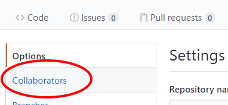
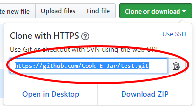
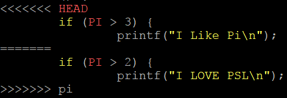
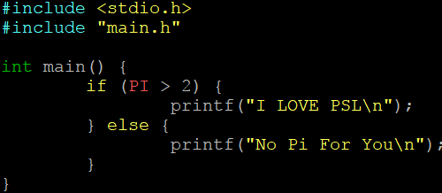

# Git and GitHub Workshop Guide

Find a partner and assign one of you as `Person A` and the other as `Person B`. Follow the directions for your letter throughout the guide. Help your partner as well, it's the way to best learn.

* Note you don't need to know any programming to use git, so don't be freaked out
* Feel free to run any of the code or deviate from guide a little.
* **WARNING** DO NOT copy and paste the git command
	1. Its good practice to type and know the commands
	2. sometimes the `"` and `'` in windows can be different then linux, so your commands don't work
	3. PLEASE feel free to copy and paste the code into files though
* You can use any text editor, notepad works well on Windows for editing files

1. [**Person A** and **Person B**] Create a new git repo and push a initial commit to GitHub
	1. Make a new folder on your local computer
	2. Open the folder inside your terminal (cd <foldername>)
	3. Run `git init` to inititalize this folder as a git repo
	4. Create a file called `main.c`
	```
	#include <stdio.h>

	int main() {
		printf("Hello Git Workshop\n");
	}
	```
	5. To see the untracked file run `git status`
	6. Now to add the file to the new commit, run `git add main.c`
	7. Run `git status` again to see your file ready for committing by being in green
	8. To make the commit, run `git commit -m "init commit" -m "git is easy"`
		- The `-m` stands for *message*
		- The first message is your git commit summary
		- The second message is **optional** and is where you would add more details about your message
		- If you run into an error you will need to set your git email and username locally
			- `git config --global user.email "yourGitHubEmail@wisc.edu"`
			- `git config --global user.name "Your GitHub UserName"`
	9. To see the commit you made, run `git log`
2. [**Person B**] We are going to use `Person A` repo so you can discard this folder if you want and help `A` with next step
3. [**Person A**] Go to GitHub (www.github.com) and create a new repo
	1. Give it any name you want
	2. Make it public
	3. Don't worry about a README, .gitignore, or license
	4. We need to tell our current repo on our local computer were we want to push our changes to with
	5. We then can push our changes up to GitHub with the link to the repo
		- `git remote add origin https://github.com/YourUserName/NameOfRepo.git`
		- `git push -u origin master`
	6. Go to GitHub and refresh page and see everything is there from your commit
	7. Now to allow `Person B` to push changes you need set them a `Collaborator` on GitHub
		- 1. 
		- 2. 
		- 3. Add the usernames of partner
4. [**Person B**]
	1. You will need to check email and accept invite to private repo
	2. We need to clone a repo `git clone <THEIR_REPO_URL>`
		- 
	3. Open the repo folder (`cd` into it) in your terminal and run `git log`
		- You should see the commit message
	4. Make a **new** file in the repo folder called `main.h` and add this to it:
	```
	#ifndef GIT_WORKSHOP_MAIN_H
	#define GIT_WORKSHOP_MAIN_H

	#define PI 3.14

	#endif
	```
	5. Also change `main.c`
	```
	#include <stdio.h>
	#include "main.h"

	int main() {
		if (PI > 3) {
			printf("I Like Pi\n");
		} else {
			printf("No Pi For You\n");
		}
	}
	```
	6. Add the files to be staged for committing with `git add -A`
		- The `-A` says to add all files to be staged
		- This can also be done with 'git add --all' and 'git add *'
		- Has to be a capital "A" for our command
	7. To commit run `git commit -m "I Like Pi"`
	8. If `Person A` did not set you as a "collaborator" on GitHub make sure you do that first
	9. To push your changes run `git push` and use your GitHub name and password
5. [**Person A**] We are going to get the new changes
	1. To pull the changes from `Person B` run `git pull`
	2. Run `git log` to see the changes
	3. Add a new subfolder called `memes`
		- You can run `mkdir memes`
	4. Find and save a jpeg or png of a meme in this folder
		- Need help? Here is a [link to help](https://www.google.com/search?rlz=1C1CHWA_enUS611US611&biw=946&bih=1109&tbm=isch&sa=1&q=most+popular+memes&oq=most+po&gs_l=psy-ab.3.0.0i67k1j0l3.17507.18194.0.19218.7.7.0.0.0.0.192.844.3j4.7.0....0...1.1.64.psy-ab..0.7.842....0.RmnvWe6UAi4)
	5. Add the folder to be commited `git add memes/`
		- If you are in the folder you can just do `git add ./` or even `git add -A`
	6. Make your commit `git commit -m "memes for days"`
	7. Make a push with `git push`
6. [**Person B**] **DO NOT PULL THE NEW MEME FOLDER COMMIT**... not yet
	1. Make a new *branch* called "pi" with `git branch pi`
	2. If you run `git branch` you will see the branches you have
	3. To *checkout* the new pi branch run `git checkout pi`
	4. Make a new subfolder called `basic`
		- `mkdir basic`
	5. Find a picture of a [pumpkin spice latte](https://i.pinimg.com/originals/ca/b8/24/cab824eeb532d8ea5746d30e7bda20ce.jpg) and add it to this folder
	6. Now change the two lines in `main.c`
		- FROM 
		```
		if (PI > 3) {
			printf("I Like Pi\n");
		```
		- TO 
		```
		if (PI > 2) {
			printf("I LOVE PSL\n");
		```
		- MAKE SURE TO CHANGE BOTH LINES
	7. Add all these changes with `git add -A`
		- Run `git status` to make sure you have a new file for the image and a modified `main.c` file
	8. Now make the commit `git commit -m "super basic"`
	9. Push changes with `git push --set-upstream origin pi`
		- This is telling it to push the `pi` branch to our `origin` remote server which is the GitHub repo
7. [**Person A**] Pull in the new branch from `Person B` running `git pull`
	1. Make sure you are **out** of the meme folder (run `cd ..`) and run `git branch` to see the other branch
8. [**Person B**] Switch back to the Master branch `git checkout master`
	1. Pull down the memes changes from before with `git pull`
	2. You can also examine the branches on GitHub
		- 
9. [**Person A** and **Person B**] Look at your file explore and the `main.c` file
	- Try switching between branches and note how it changes your folders and files for you
	- `git checkout pi` and `git checkout master`
	- You should see that the folder for `memes` and `basic` switch automatically for you. Also `main.c` switches
10. [**Person A**] Time to merge to branch into master!
	- Make sure you are at the top of your git directory
	- Switch to the master branch if you have are not `git checkout master`
	- Now time to merge with `git merge pi`
		- If a text editor comes ou you can just exit out
			- If Vim or Vi run `:q`
			- If Nano run `Ctrl + x`
	- 
	- Don't panic, we can do this!
	- Open up `main.c` in any text editor and you will probably see this:
		- 
	- So this is **SUPER easy**, just delete the lines you don't want and keep the ones you do
		- The whole point of a merge conflict is to let you handle cases where git can't
	- Your new code might look like this
		- 
	- Now you've fixed it! Just add and commit
		- `git add main.c`
		- `git commit -m "I merged the conflict`
		- `git push`

## YOU DID IT

That wasn't that hard, was it now? Feel free to play around and make random commits. Try and test out other features while you have time to mess around and get your hands dirty.
