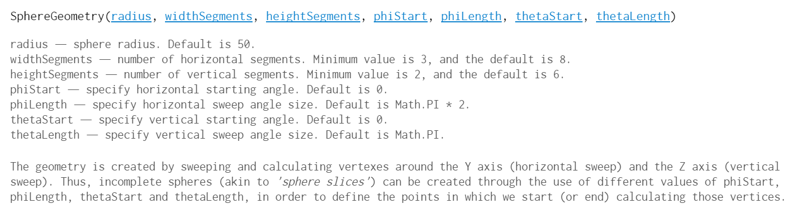

# ThreeJS Workshop Guide

For this workshop to save time there is already a template to get up and going. Go to the [IEEE ThreeJS-Workshop-Template](https://github.com/uwmadisonieee/ThreeJS-Workshop-Template) and either clone or download it.

To get the template running [follow the instruction](https://github.com/uwmadisonieee/ThreeJS-Workshop-Template/blob/master/README.md). Once you get the spinning earth going, come back and start this workshop guide!


## Learning from tweaking

> We are going to change a few parameters and explain what is happening. This will help get a better feel what all the lines of code in this template are actually doing

### Camera

```
camera = new THREE.PerspectiveCamera( 70, window.innerWidth / window.innerHeight, 1, 1000 );
camera.position.z = 400;
```

This is our camera object, but to really under stand it we first should look at the [THREE.PerspectiveCamera Documentation](https://threejs.org/docs/index.html#api/cameras/PerspectiveCamera) which is displayed below


To further explain more here is an image of the camera object if viewed from a 3rd person


Few things to note from this camera diagram

- We use the right hand rule so we need a **positive** Z value to look the origin where our Earth model is
	- Change the `camera.position.z` to be a different value like `600`.
	- Now change it to 100 and refresh... black screen?
		- Our globe has a radius of `200` so anything less than `200` and you will actually have the camera inside it. 
	- Try making the `camera.position.z` to `2000`
		- Since this is greater than the *far plane* (which is at `1000`) then the earth will disappear
	- You can change the `camera.position.z` back or increase the *far plane*

**BEFORE WE MOVE ON ANY FURTHER**

You might have noticed its annoying to constantly reload the page, well sometimes we can edit the page live!

- Set the values so you see the globe
- Open the Console in your browser
	- Chrome: `ctrl + shift + j`
	- Right click > "inspect element" > Console window
- Since we have `camera` as a global variable it is accessible to the browser console window
- 
- **NOTE:** When you edit in the browser console all effects are not saved in the file therefore it will clear any changes on reload
- Play around with the camera a little bit and then continue on with the workshop 

### Geometry

```
var geometry = new THREE.SphereGeometry( 200, 128, 128 );
```

So as I will say time and time again, always look at the [Documentation](https://threejs.org/docs/index.html#api/geometries/SphereGeometry) to see what the parameters all do



**NOTE:** We are constructing this inside `init()`, therefore you can't edit it live in the console window as you were with the camera

- Play around with the sphere setting in the [live demo in the docs](https://threejs.org/docs/index.html#api/geometries/SphereGeometry) with the `THREE.SphereGeometry` dropdown box in the upper right corner
- Feel free to mess around with the earth parameter
- We will create different geometery later in this workshop

### Material

Just like the geometry, you can mess with all the parameters for Material online [in the ThreeJS docs](https://threejs.org/docs/index.html#api/materials/MeshBasicMaterial)

### Scene

- You can set the background to a color for the entire scene.
	- Somewhere under where you create the scene object add: `scene.background = new THREE.Color( 0xFF0000 );`
- Want some fog, ThreeJS got you covered!
	- Add `scene.fog = new THREE.FogExp2( 0xcccccc, 0.002 );`

### Animation

The animation function is a very important part of any graphics application. There a few things to note:

- Try to make it short, otherwise your frame rate will drop
- Remember that it might be running at 60fps so things might happen too fast to see or notice
- Try messing around with the rotation
- Maybe add some other effect inside it right now

## Creating a basic Audio Visualizer

We are going to create a really quick and easy audio visualizer using a ThreeJS

### Setup

1. First go to the `index.html`
	- Comment or remove the `<script src="javascript/main.js"></script>` line
	- Uncomment the threes lines for 
	```
	<script src="library/OrbitControls.js"></script> 
    <script src="javascript/audioVisualizer.js"></script>    
    <audio id="myAudio"></audio>
	```
	- The `OrbitControls.js` is a helper file for the ability to click and look around the screen
	- `audioVisualizer.js` is the new file we will be working with
2. Open `javascript/audioVisualizer.js` in a text editor
3. First thing is lets create a `scene` object in our `init()` function
	- Add `scene = new THREE.Scene();` in the top of the `init()` function
4. Next under the scene code lets add the boilerplate renderer code
	- This is the code you use 99% of the time to setup the renderer
	```
	renderer = new THREE.WebGLRenderer();
    renderer.setPixelRatio( window.devicePixelRatio );
    renderer.setSize( window.innerWidth, window.innerHeight );

    document.body.appendChild( renderer.domElement );
	```
5. Now lets add a perpective camera as we did in our other exampe
	- The `FoV` and `position` values can always be tweaked if you want
	```
	camera = new THREE.PerspectiveCamera( 60, window.innerWidth / window.innerHeight, 1, 1000 );
    camera.position.z = 500;    
	```
6. To use the new `Orbit Control` library we added we need to attach it to the camera
	- This is the last of the *boilerplate* code
	```
	controls = new THREE.OrbitControls( camera, renderer.domElement );
    controls.enableZoom = false;
	```
7. Time to create some geometry
	- We are going to create a BoxGeometry and set the width, hight, and depth all to the size `10`
	- We are only creating one instance of it since we want to share it across all the boxes
	```
	var geometry = new THREE.BoxGeometry( 10, 10, 10 );
	```
8. We want to create 64 boxes that will make up our audio visualizer
	- Frist we will need to create a for loop
		- `for (i = 0; i < 64; i++) {}`
	- Inside the loop we want to be able to control each color of the boxes **independently** so we create a new Material
	- `var material = new THREE.MeshLambertMaterial( { color: 0x0000FF } );`
		- We are using a Lambert material so we will need to add lighting to the scene later
		- `0x0000FF` is blue
	- Next we want to create a Mesh and add it to or `meshArray`
		- Meshes are the actual objects you see on the screen and combine a geometry and material object
		- `meshArray.push(new THREE.Mesh( geometry, material ));`
	- To center the boxes and give them some room inbetween each other we set the initial position of all the boxes
	- `meshArray[i].position.x = (i - 32) * 15;`
		- we use `i - 32` to have half the 64 boxes on the left of origin and the other half on the right
		- The `15` is used to give space inbetween since each box is 10 units wide 
	- Lastly we need to add the mesh to our Scene
		- `scene.add( meshArray[i] );`
	- With all these steps your code should look like this
	```
	for (i = 0; i < 64; i++) {
        var material = new THREE.MeshLambertMaterial( { color: 0x0000FF } );
        meshArray.push(new THREE.Mesh( geometry, material ));
        meshArray[i].position.x = (i - 32) * 15;
        scene.add( meshArray[i] );
    }
	```
9. We will be adding two sets of light
	- First we add a directional light that will be white (0xffffff)
		- `var dirLight = new THREE.DirectionalLight( 0xffffff );`
	- Directional lights default aim towards the origin so we will set it so it shines down from the corner angle
		- `dirLight.position.set( 1, 1, 1 );`
	- Time to add to scene
		- `scene.add( dirLight );`
	- We will want so filler light otherwise anything behind the directional light will not been seen
		- `var AmbLight = new THREE.AmbientLight( 0x222222 );`
		- This gives a light grey color light to anything behind the direction light line of sight
	- Don't forget to add to the scene
		- `scene.add( AmbLight );`
	- With all these steps your code should look like this
	```
	var dirLight = new THREE.DirectionalLight( 0xffffff );
    dirLight.position.set( 1, 1, 1 );
    scene.add( dirLight );

    var AmbLight = new THREE.AmbientLight( 0x222222 );
    scene.add( AmbLight );
	```
10. We need to add what to do on a change of window size so next lets add a event listener
	- `window.addEventListener( 'resize', onWindowResize, false );`
11. We now need to add code to the `onWindowResize` given in the event listener
	- This is a boilerplate code for most applications
	```
	function onWindowResize() {

	    camera.aspect = window.innerWidth / window.innerHeight;
	    camera.updateProjectionMatrix();

	    renderer.setSize( window.innerWidth, window.innerHeight );
	}
	```
12. Going back to `init()` function at the bottom lets make two big calls now that everything is setup
	- First we will call `setupAudio();` which for this workshop is just going to start our audio sample and have the data writtne to the variable `frequencyData`
	- Next we need to finally call `animate();` and start the animation cycle
	- These are the last two calls we will make in our `init()` function
13. The animation function needs to do 4 things
	1. request the next frame
	2. change our boxes
	3. update the orbital control camera
	4. render it all to the screen
14. Inside our `animate()` function the first thing to add is `requestAnimationFrame( animate );`
	- This is the special function call to loop the `animate()` function after each frame
15. We now are going to update the boxes to match the audio at that frame
	- The first thing we need to do is call `analyser.getByteFrequencyData(frequencyData);`
		- This will set `frequencyData` to an array that has the intensity of 64 different sections for use between 0-255
	- We now need to create a loop to alter each of the boxes
		- `for (i = 0; i < 64; i++) {}`
	- We will adjust the scale of the y axis of each box
		- `meshArray[i].scale.y = Math.max(1, frequencyData[i]) / 10;`
			- We use `Math.max()` because we want 1 to be our base scale level
	- Next to adjust the color we will set the red and green value between 0 and 1 depending on how intense the value is
		```
		meshArray[i].material.color.r = frequencyData[i] / 255;
        meshArray[i].material.color.g = frequencyData[i] / 255;
		```
16. To update the orbital control on the camera we just need to call `controls.update();`
17. To render we just need to call `render()` and we are set to go
18. You should be able to see your audio visualizer in action now
	- To verify your code here is what the `animate()` function should look like
	```
	function animate() {

	    requestAnimationFrame( animate );
	    
	    analyser.getByteFrequencyData(frequencyData);
	    for (i = 0; i < 64; i++) {
	        meshArray[i].scale.y = Math.max(1, frequencyData[i]) / 10;
	        meshArray[i].material.color.r = frequencyData[i] / 255;
	        meshArray[i].material.color.g = frequencyData[i] / 255;
	    }

	    controls.update();

	    render();
	}
	```	