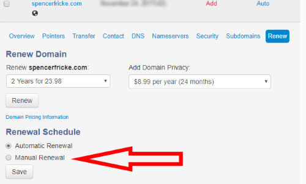
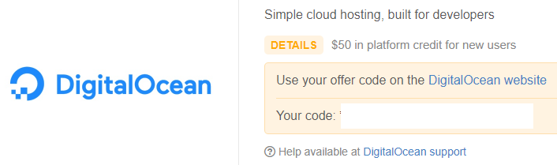
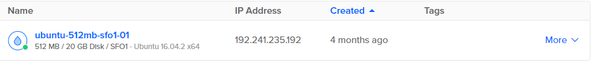
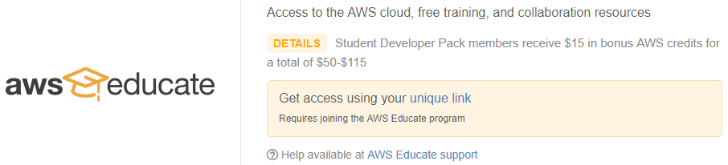
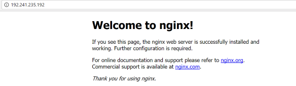

# Websites Workshop Guide
This is a quick reference guide to the following differnet aspects of hosting a website. There are many great resources to learn how to [make a website](https://github.com/uwmadisonieee/Tutorials/tree/master/Lynda) and for that we will skip that part.

> Need a demo site?
>
> If you need a set of files to play with we have a [basic little static website to use](./Websites_Template)

- [GitHub Student Pacakge](#github-student-pacakge)
- [Text Editors](#text-editors)
- [Domain Name](#domain-name)
	- [Namecheap](#namecheap)
	- [Domain.com](#domaincom)
- [Hosting Site](#hosting-site)
	- [Digital Ocean](#digital-ocean)
	  - [Creating a Digital Ocean server](#creating-a-digital-ocean-server)
	- [AWS](#aws)
	  - [Creating an AWS static website](#creating-an-aws-static-website)
	  - [Creating a AWS server](#creating-a-aws-server)
	- [Azure](#azure)
- [Running a basic webserver](#running-a-basic-webserver)
	- [Python](#python)
	- [NodeJS](#nodejs)
- [Setting up Nginx](#setting-up-nginx)

## GitHub Student Pacakge

Almost all these offers below require a student account and some also require the [GitHub Student Package](https://education.github.com/pack). Essentially its as easy as clicking a button to get all the great offers. If you don't have a GitHub account its [super easy to make](https://github.com/join?source=header-home)

**NOTE:** The rest of this guide assumes you have the GitHub Student Package activated

## Text Editors

Here are few great text editors if you need one to edit your website files

- [Sublime Text](https://www.sublimetext.com/)
- [Atom Text Editor](https://atom.io/)

## Domain Name

Most domains are cheap for at least one year and then the renewal cost can go up. You never have to renew a domain and if you plan to use it then feel no pressure getting one.

**NOTE:** It can take anywhere between 20 minutes and a day for your new domain to become public, this is due to how the internet works and DNS servers sharing info with one another.

### Namecheap

[Namecheap](https://nc.me/) gives free domain for a year

### Domain.com

To use the [Domain.com](https://domain.com) free domain you need a MLH Sponsored card

The nice part of these is you can have more than one compared to only getting one with Namecheap

#### Setting up Domain.com

- Once you have a domain name up and ready go to the **Domain Central** portal
- Find you domain and click it
- **NOTE:** I would turn **Off** auto renew. You can turn it on if you decide to keep domain in year

- Next go to `DNS`
- Select `A Recorder` to modify
- Change `*`, `www` and the *domain name itself* to the IP Adress you want to point the domain at
	- You may need to include one of the three if they name is not there already

- Next go to `Nameservers`
- This is where if you are using [Cloudflare](https://www.cloudflare.com) you can add the nameservers they tell you to add
	- otherwise leave as default
- 
 
## Hosting Site

There are **many** options to host a website, here are just a few, mainly including the ways to do it for free as a student.

**NOTE:** that many of these will make you put a Credit Card or some payment account. I suggest creating a reminder when your free credits will run out!

### Digital Ocean

[Digital Ocean](https://www.digitalocean.com/) offers Linux Virtual Machines that you can run a basic website on.

- Through the [GitHub Student Package](https://education.github.com/pack) you get $50 Credit

- The lowest tier of server is $5/month
	- This server is equivalent of compute power as a Raspberry Pi, so don't aspect it to handle anything that requires many users at the same time to connect too.

#### Creating a Digital Ocean server

- First make an account and add your credits in the account settings
- Create a new **droplet**
	- There are many `one-click` options to bypass the configurations
	- Otherwise a basic Ubuntu server works well
- You can either SSH into the server or access the console
- **Note:** Digital Ocean has a TON of documentation how to do about everything if you just Google it

- To learn to use Linux to run your terminal [read here](https://github.com/uwmadisonieee/Tutorials/tree/master/Linux)
- [Below section](#setting-up-nginx) goes over how to set up Nginx for your website

### AWS

[Amazon Web Service](https://aws.amazon.com/) is a very popular choice to host your website on.

- Through the [GitHub Student Package](https://education.github.com/pack) you get $100-115 Credit

- Another way is to use the [general AWS Education](https://www.awseducate.com/Registration) offer

#### Creating an AWS static website

Amazon does a great job explaining how to do this [already on their quickstart guide](https://console.aws.amazon.com/quickstart-website/new)

#### Creating a AWS server

The best method is to use [AWS EC2](https://aws.amazon.com/ec2/) which lets you run a linux based server for which you can host your site

- To learn to use Linux to run your terminal [read here](https://github.com/uwmadisonieee/Tutorials/tree/master/Linux)
- [Below section](#setting-up-nginx) goes over how to set up Nginx for your website

### Azure

I have personally never ran Azure, but would be happy if anyone who does/has add to this part

Here is the [link to get free Azure credits](https://azure.microsoft.com/en-us/free/)

## Running a basic webserver

Running a webserver really just means you have some code running that waits for a HTTP request and then return it the website. This section just describes deploying a basic webserver, more information about writing server side code and creating a backend can be [found here](https://github.com/uwmadisonieee/Server-And-Database-Workshop)

**Note:** These all explain how to do it via command line, so click [here](https://github.com/uwmadisonieee/Tutorials/tree/master/Linux) to learn to use a Linux terminal

### Python

- Open terminal and get to directory of website
- Make sure you have node by running `python --version`
- Run `python -m SimpleHTTPServer`
	- it will defaut at port 8000
- To change to a different port, for instance, port 9001
	- run `python -m SimpleHTTPServer 9001`

### NodeJS

- Open terminal 
- Make sure you have node by running `node -v`
- Run `sudo npm install -g http-server`
	- the `-g` means global so you only need to run this once on the server
- Get to directory of website
- Run `http-server`
	- it will defaut at port 8080
- To change to a different port, for instance, port 9001
	- run `http-server -p 9001`

## Setting up Nginx

- To see if you have nginx installed already run `nginx -v`
- If nginx is not installed run
	- `sudo apt-get update`
	- `sudo apt-get upgrade`
	- `sudo apt-get install nginx`
- To see if nginx is running run `sudo service nginx status`
- If nginx is not on you can start it by running `sudo service nginx start`
- If nginx is up you should go to the IP address of the server and you should see the "nginx welcome" page
- 
- By default nginx sets the directory for static pages in `/var/www/html/`
- Run `cd /var/www/html/` and if you run `ls` you will see the "nginx welcome" page
- Nginx is set as default to look for files starting with `index` as the starting page
- Delete the "nginx welcome" page and put your own `index.html` file in `/var/www/html/index.html`
	- Note if you are using Vim, Emacs, Nano, etc that you run it as sudo or you will not be able to save the file you just edit
