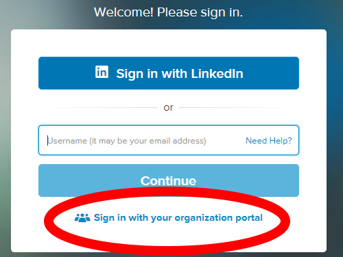
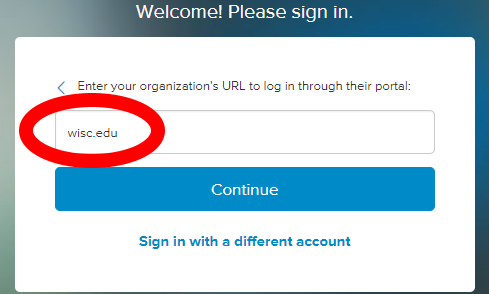

# Lynda.com for UW-Madison Students

[Lynda.com](https://www.lynda.com/) is an online library of high quality videos for Developers, Artists, and everything in between. It normally cost $29.99/Month for their Premium plan but you get it for **FREE** being an UW-Madison student!

## How to get on your Free Lynda.com account

1. Go to [Lynda.com](https://www.lynda.com/)
2. Click `Sign In` in top right corner
	- 
3. Click `Sign in with your organization portal` on bottom of Login screen
	- 
4. Type in `wisc.edu` and then press `Continue`
	- 
5. Login to your Wisc.edu account
6. If it ask you if you have a Lynda.com account you can just say "No"
7. Enjoy your endless amount of videos to watch!

## Why Lynda.com is great

- You get quality videos about anything you can think about learning
- You get to download the materials they use in the video
- You can download videos for offline watching with their app
- They have a transcript for each video and closed captions
- They try to update their videos with newer version of software that come out yearly
- They break videos well into sections
