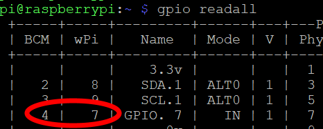
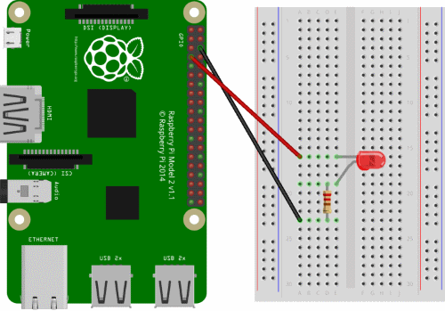

# Raspberry Pi Home IoT - Workshop Guide

<!-- START doctoc generated TOC please keep comment here to allow auto update -->
<!-- DON'T EDIT THIS SECTION, INSTEAD RE-RUN doctoc TO UPDATE -->
**Table of Contents**  *generated with [DocToc](https://github.com/thlorenz/doctoc)*

- [Raspberry Pi Home IoT - Workshop Guide](#raspberry-pi-home-iot---workshop-guide)
  - [Connecting to the Raspberry Pi](#connecting-to-the-raspberry-pi)
  - [Blinking a LED Light](#blinking-a-led-light)
    - [Choosing the GPIO Pin](#choosing-the-gpio-pin)
    - [Hooking up the LED](#hooking-up-the-led)
    - [Writing the script](#writing-the-script)
  - [Control LED from Web](#control-led-from-web)
    - [Getting the sample code](#getting-the-sample-code)
    - [Understanding the sample code](#understanding-the-sample-code)
      - [server.py](#serverpy)
      - [static/index.html](#staticindexhtml)
      - [static/main.js](#staticmainjs)
    - [Setting up LED](#setting-up-led)
    - [Running Code](#running-code)
  - [Something Cooler!](#something-cooler)

<!-- END doctoc generated TOC please keep comment here to allow auto update -->

## Connecting to the Raspberry Pi

- We will cover this in person for the workshop today since we are still working on better way of getting Pi on an internet system at the Makerspace

## Blinking a LED Light

This is a great *Hello World* for anyone completly new, if you want to skip ahead, feel free to as well. We are going to just write a super simple program to toggle a LED light to get use to using the GPIO pins.

### Choosing the GPIO Pin

We are going to be using **Physical GPIO Pin**: 7

You can also check by calling `gpio readall`



You can see that the **WiringPi** library also recognizes this as GPIO Pin 7

### Hooking up the LED

We need to take the positive pin of the LED and put it in **series** with the resistor. We also need to put he ground pin to any of the **ground** pins on the Pi



### Writing the script

1. First create a file with `nano blink.py`
2. Copy the code
```
import RPi.GPIO as GPIO
import time

LED = 7

GPIO.setmode(GPIO.BOARD)
GPIO.setup(LED, GPIO.OUT)

while(1):
	GPIO.output(LED, GPIO.HIGH)
	time.sleep(1)
	GPIO.output(LED, GPIO.LOW)
	time.sleep(1)
```

3. To run the code run `python blink.py`

## Control LED from Web

Here we are going to showoff a great use case for the Pi. We will be controlling the LED, but from our own website we created.

### Getting the sample code

The Pi should already have the code we downloaded ahead of time, in case it doens't have it just run `git clone https://github.com/uwmadisonieee/Raspberry-Pi-IoT-Workshop.git` to get it.

### Understanding the sample code

#### server.py

This is the main "server program" we are going to run. It uses the [Flask Library](http://flask.pocoo.org/) which is a popular python server library. Lets dive into the code a little to understand what is going on.

```
from flask import Flask, send_from_directory
import RPi.GPIO as GPIO
```

This is just importing the two libraries we are using. The first is the flask library files and the second is the GPIO library built into Raspbian

```
# Setup LED
LED = 7
GPIO.setmode(GPIO.BOARD)
GPIO.setup(LED, GPIO.OUT)
```

This is the same as above in the LED example. We need to make sure we set our LED to be correctly used as an output GPIO on the correct pin.

```
app = Flask(__name__, static_url_path="")
app._static_folder = "static"
```

This creates the Flask instance of the server and tells it all our files are in the `static/` folder

```
# Creates route for LED
@app.route('/LED/<int:status>')
def led(status):
    if status == 0:
	GPIO.output(LED, GPIO.LOW)
    elif status == 1:
	GPIO.output(LED, GPIO.HIGH)

    return 'LED Light status set to: ' + str(status)
```

This is the main function that turns the light on and off. We are waiting for a HTTP GET request to `/LED/0` or `LED/1`. From here we check the value of `status` and turn the LED on or off accordingly.

```
@app.route('/')
def root():
	return app.send_static_file('index.html')

```

This is the code to tell the server to load the webpage in the `static` folder we defined above

```
if __name__ == '__main__':
    app.run(debug=True, host='0.0.0.0')
```

This tells our code to run the Flask server and it will default run at port 5000

#### static/index.html

The main line to recoginze from this HTML file is 

`<button class="IoTButton" id="button0" onclick="buttonClick(0)">Button 0</button>`

This is where we create our Button with `onclick="buttonClick(0)"`. This means when we click the button it will call the `buttonClick` function we have in `main.js`


#### static/main.js

In this javascript file we have one function to handle the button clicks and they call:

```
$.get("/LED/0", function() {
	console.log("Turned LED off");
});
```

This is using the jQuery library to make an **HTTP GET request** to our server. This will trigger the `/LED/0` logic in our `server.py` and turn the LED off. When the server is done it will return and run the code inside the `function()` block which in this case just prints the status

### Setting up LED

Please refer to [Hooking up the LED](#hooking-up-the-led) for instructions how to setup a LED into Pin 7 on the board.

### Running Code

1. Check our IP address of you Pi by running `hostname -I`
2. Run the server on the Pi with `python server.py`
	1. Make sure you are in the folder of the `Raspberry-Pi-IoT-Workshop` folder
3. On your Laptop/Phone connected to same network, go to your server application
	1. Example: if your Pi is on `192.168.43.100` then you will go to `192.168.43.100:5000` on your laptop
4. Click Button 0 and Button 1 to toggle the LED

## Something Cooler!

This is where I turn to you and ask "What do you want to make". There are endless options and we have various sensors and motors at the Makerspace to choose from.