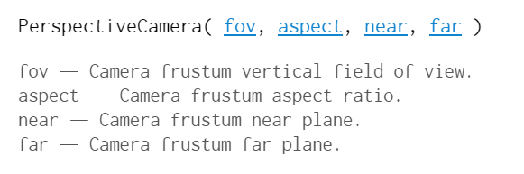
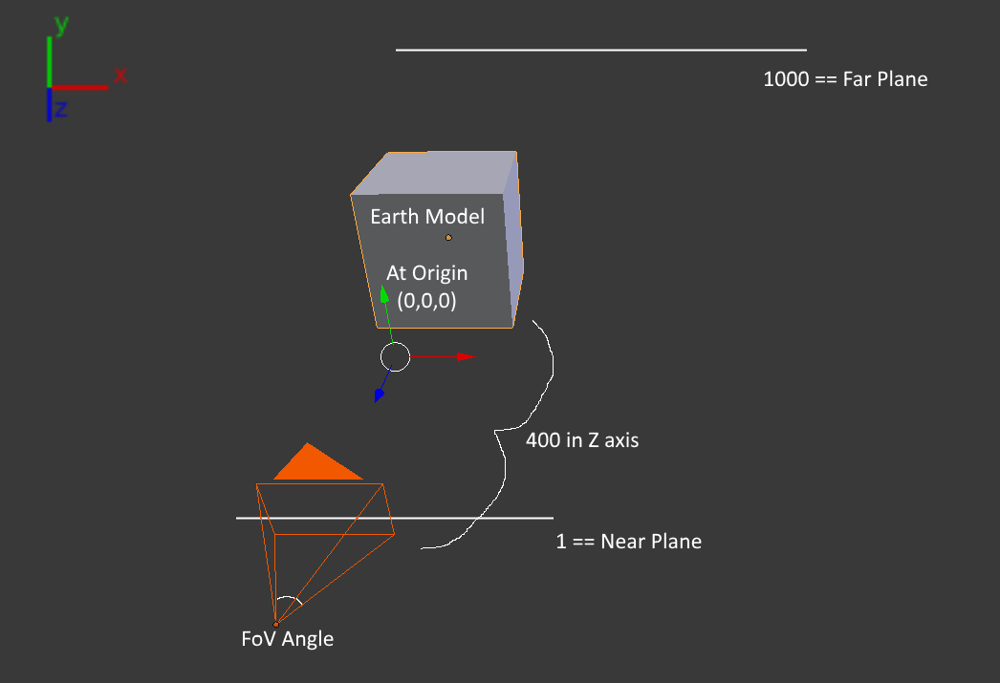
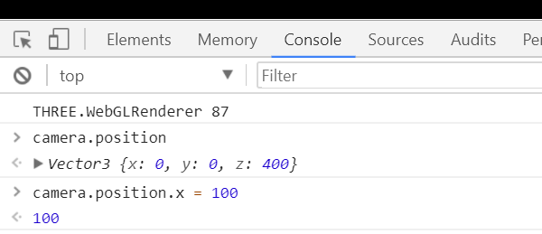

# ThreeJS Workshop Guide

For this workshop to save time there is already a template to get up and going. Go to the [IEEE ThreeJS-Workshop-Template](https://github.com/uwmadisonieee/ThreeJS-Workshop-Template) and either clone or download it.

To get the template running [follow the instruction](https://github.com/uwmadisonieee/ThreeJS-Workshop-Template/blob/master/README.md). Once you get the spinning earth going, come back and start this workshop guide!

## Learning from tweaking

> We are going to change a few parameters and explain what is happening. This will help get a better feel what all the lines of code in this template are actually doing

### Camera

```
camera = new THREE.PerspectiveCamera( 70, window.innerWidth / window.innerHeight, 1, 1000 );
camera.position.z = 400;
```

This is our camera object, but to really under stand it we first should look at the [THREE.PerspectiveCamera Documentation](https://threejs.org/docs/index.html#api/cameras/PerspectiveCamera) which is displayed below



To further explain more here is an image of the camera object if viewed from a 3rd person



Few things to note from this camera diagram

- We use the right hand rule so we need a **positive** Z value to look the origin where our Earth model is
	- Change the `camera.position.z` to be a different value like `600`.
	- Now change it to 100 and refresh... black screen?
		- Our globe has a radius of `200` so anything less than `200` and you will actually have the camera inside it. 
	- Try making the `camera.position.z` to `2000`
		- Since this is greater than the *far plane* (which is at `1000`) then the earth will disappear
	- You can change the `camera.position.z` back or increase the *far plane*

**BEFORE WE MOVE ON ANY FURTHER**

You might have noticed its annoying to constantly reload the page, well sometimes we can edit the page live!

- Set the values so you see the globe
- Open the Console in your browser
	- Chrome: `ctrl + shift + j`
	- Right click > "inspect element" > Console window
- Since we have `camera` as a global variable it is accessible to the browser console window
- 
- **NOTE:** When you edit in the browser console all effects are not saved in the file therefore it will clear any changes on reload
- Play around with the camera a little bit and then continue on with the workshop 

### Geometry

```
var geometry = new THREE.SphereGeometry( 200, 128, 128 );
```

So as I will say time and time again, always look at the [Documentation](https://threejs.org/docs/index.html#api/geometries/SphereGeometry) to see what the parameters all do


**NOTE:** We are constructing this inside `init()`, therefore you can't edit it live in the console window as you were with the camera

- Play around with the sphere setting in the [live demo in the docs](https://threejs.org/docs/index.html#api/geometries/SphereGeometry) with the `THREE.SphereGeometry` dropdown box in the upper right corner
- Feel free to mess around with the earth parameter
- We will create different geometery later in this workshop

### Material

Just like the geometry, you can mess with all the parameters for Material online [in the ThreeJS docs](https://threejs.org/docs/index.html#api/materials/MeshBasicMaterial)

### Scene

- You can set the background to a color for the entire scene.
	- Somewhere under where you create the scene object add: `scene.background = new THREE.Color( 0xFF0000 );`
- Want some fog, ThreeJS got you covered!
	- Add `scene.fog = new THREE.FogExp2( 0xcccccc, 0.002 );`

### Animation

The animation function is a very important part of any graphics application. There a few things to note:

- Try to make it short, otherwise your frame rate will drop
- Remember that it might be running at 60fps so things might happen too fast to see or notice
- Try messing around with the rotation
- Maybe add some other effect inside it right now

## Creating a basic Audio Visualizer

We are going to create a really quick and easy audio visualizer using a ThreeJS

### Setup

1. First go to the `index.html`
	- Comment or remove the `<script src="javascript/main.js"></script>` line
	- Uncomment the two lines for `library/OrbitControls.js` and `javascript/audioVisualizer.js`
